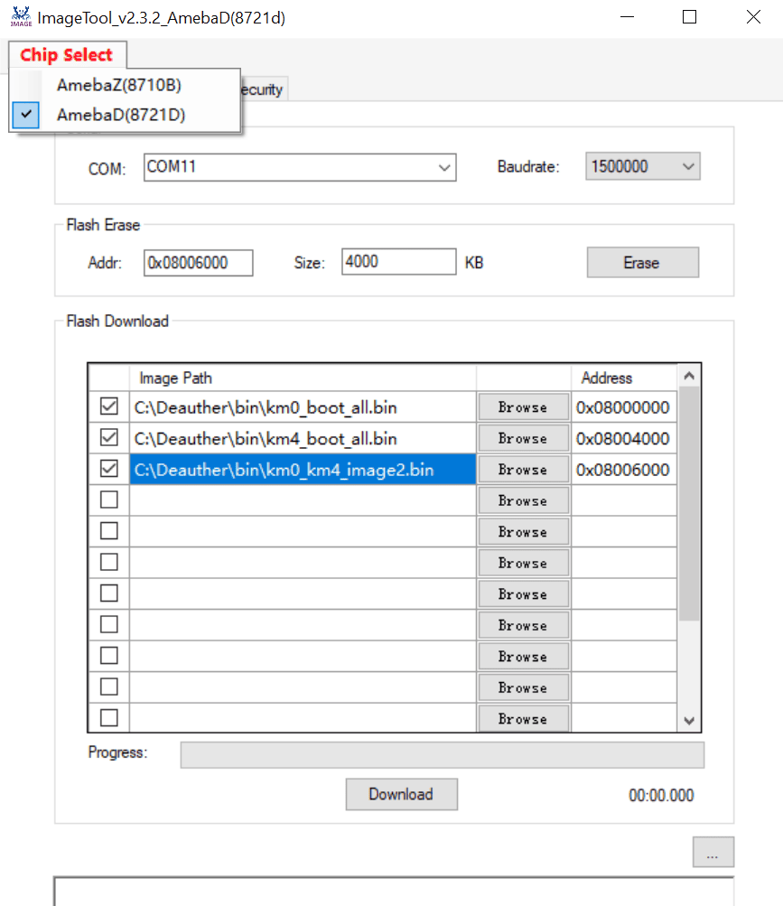

# BW16-SH110x

A WiFi deauther and network tool for the Realtek Ameba D (RTL8720DN) platform, supporting both WebUI and SH110x OLED display modes.

---

## Features

- **Tested and works on Realtek Ameba Board version 3.1.8**
- Supports **128x128 OLED displays** using the SH110x chipset (Adafruit_SH1107 library)
- **Dual mode operation:**
  - **Wireless/WebUI mode** by default
  - **Display mode** when an SH110x OLED is connected (auto-detects at boot)
- **WiFi scanning, deauth, beacon, and association attacks** via WebUI or display
- **Responsive WebUI** for mobile and desktop
- **Button navigation** for display mode (when available)
- **Easy flashing**: Prebuilt `.bin` file can be flashed using Realtek's ImageTool_Amebad

---

## Board Setup

### 1. **Install Ameba Board Support**

- Open Arduino IDE
- Go to **Preferences** → **Additional Boards Manager URLs**
- Add this JSON URL:

  ```
  https://raw.githubusercontent.com/Ameba-AIoT/ameba-arduino-d/master/Arduino_package/package_realtek_amebad_index.json
  ```

- Go to **Tools → Board → Boards Manager**
- Search for **AmebaD** and install **version 3.1.8** (tested version)

### 2. **Select Board**

- **Tools → Board → "RTL8720DN(BW16)"** (or your compatible Ameba D board)

---

## Display Support

- Designed for **128x128 OLED** with SH110x controller (e.g., SH1107)
- Uses the Adafruit_SH1107 library
- Automatically detects display at boot; if not present, runs in WebUI-only mode

---

## Usage

- **Default mode:** Wireless/WebUI (connect to device AP, open WebUI in browser)
- **Display mode:** If SH110x OLED is connected, you can use onboard buttons to navigate and control attacks
- **Switching modes:** Press the "Back" button at the home screen to toggle between WebUI and display mode

---

## Flashing with ImageTool_Amebad

If you want to flash the prebuilt `.bin` file using Realtek's ImageTool:

1. Open **ImageTool_Amebad**
2. Load your `.bin` file in the appropriate section (usually "Application")
3. Configure the tool as shown below:

   

4. Click **Download** to flash your board

---

## Code Credits

This project is based on and inspired by:

- [tesa-klebeband/RTL8720dn-Deauther](https://github.com/tesa-klebeband/RTL8720dn-Deauther)
- [warwick320/NovaX-5G-RTL8720dn-Bw16-Deauther](https://github.com/warwick320/NovaX-5G-RTL8720dn-Bw16-Deauther)

---

## License

This project is for educational and research purposes only.  
Use responsibly and only on networks you own or have permission to test.
